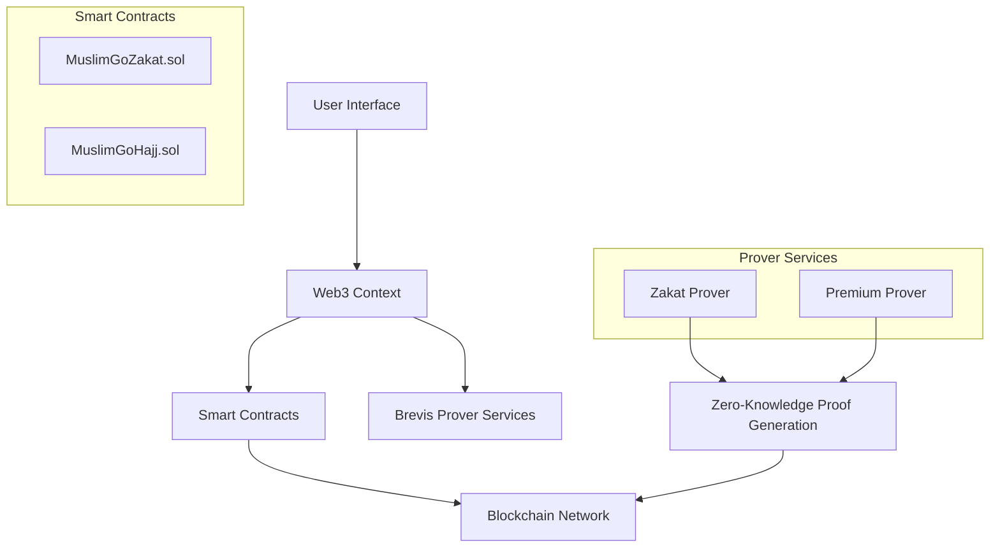
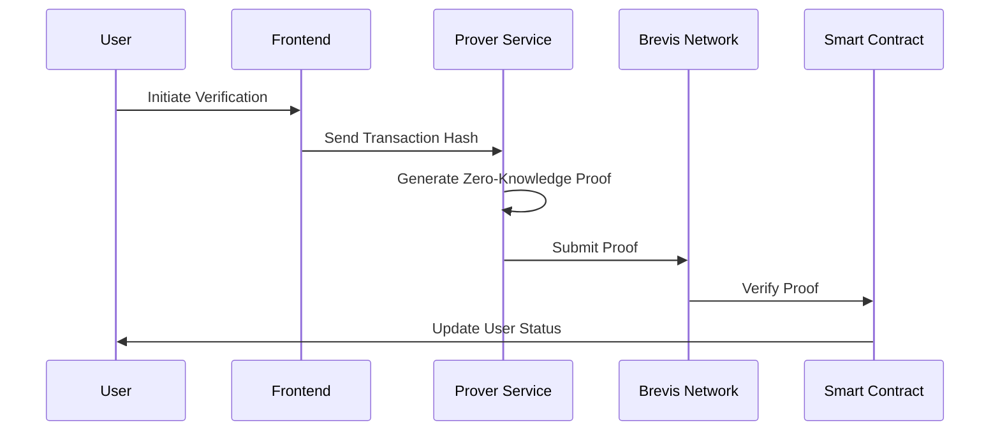

# MuslimGo: Shariah-Compliant Financial Platform

## Overview

MuslimGo is an innovative blockchain-based platform designed to help Muslims fulfill their religious financial obligations through secure, transparent, and interest-free mechanisms.

## Architecture Diagram



## Core Components

### 1. Zakat Management System
- Automated 2.5% Zakat calculation
- Verifiable asset holdings
- Transparent charitable distribution
- Privacy-preserving donation tracking

### 2. Hajj Savings Program
- Premium tier feature
- Zero-knowledge proof verification
- Goal-based savings management
- Smart contract fund tracking

## Technical Stack

### Frontend
- React (Vite)
- TypeScript
- Chakra UI
- Ethers.js
- Web3 Context

### Backend
- Go-based Prover Services
- Node.js Proof Generation API
- Brevis Zero-Knowledge Proof SDK

### Blockchain
- Solidity Smart Contracts
- Sepolia Testnet
- OpenZeppelin Libraries

## Zero-Knowledge Proof Workflow



## Getting Started

### Prerequisites
- Node.js 16+
- Go 1.20+
- MetaMask Wallet
- Sepolia Testnet ETH

### Installation

1. Clone the Repository
```bash
git clone https://github.com/your-org/muslimgo.git
cd muslimgo
```

2. Setup Frontend
```bash
cd muslim-go-frontend
npm install
npm run dev
```

3. Setup Prover Services
```bash
cd brevis/prover
make install
make start
```

### Running Prover Services

#### Zakat Prover
```bash
# Windows
& "$env:USERPROFILE\go\bin\zakat_prover.exe" -port=33247

# Linux/Mac
./zakat_prover -port=33247
```

#### Premium Prover
```bash
# Windows
& "$env:USERPROFILE\go\bin\premium_prover.exe" -port=33248

# Linux/Mac
./premium_prover -port=33248
```

## Smart Contracts

### Zakat Contract
- Address: `0xe41279a05f3eec58acdb7df13de3148db912dfd5`
- Network: Sepolia Testnet
- Features:
  - Asset verification
  - Zakat calculation
  - Charitable distribution

### Hajj Savings Contract
- Address: `0x0e2aebe3e835d93dfb8bf3cf69a41c88f10368e7`
- Network: Sepolia Testnet
- Features:
  - Premium user verification
  - Savings goal tracking
  - Fund management

## Islamic Finance Principles

1. **No Riba (Interest)**
   - Completely interest-free financial mechanisms
   - Purpose-driven savings and contributions

2. **Transparency**
   - Clear tracking of all financial transactions
   - Zero-knowledge proofs maintain privacy

3. **Charitable Intent**
   - Automated Zakat calculation
   - Direct charitable distribution
   - Verified contribution tracking

## Development Roadmap

- [x] MVP Development
- [ ] Enhanced UI/UX
- [ ] Multi-Chain Support
- [ ] Advanced Shariah Compliance Features

## Security

- Zero-Knowledge Proof Verification
- OpenZeppelin Access Controls
- Minimal Data Exposure
- Blockchain-Based Transparency

## Contributing

1. Fork the Repository
2. Create Feature Branch
3. Commit Changes
4. Push to Branch
5. Open Pull Request

## License

MIT License

## Disclaimer

MuslimGo is a technological solution and should not replace consultation with religious scholars for precise Zakat and financial guidance.